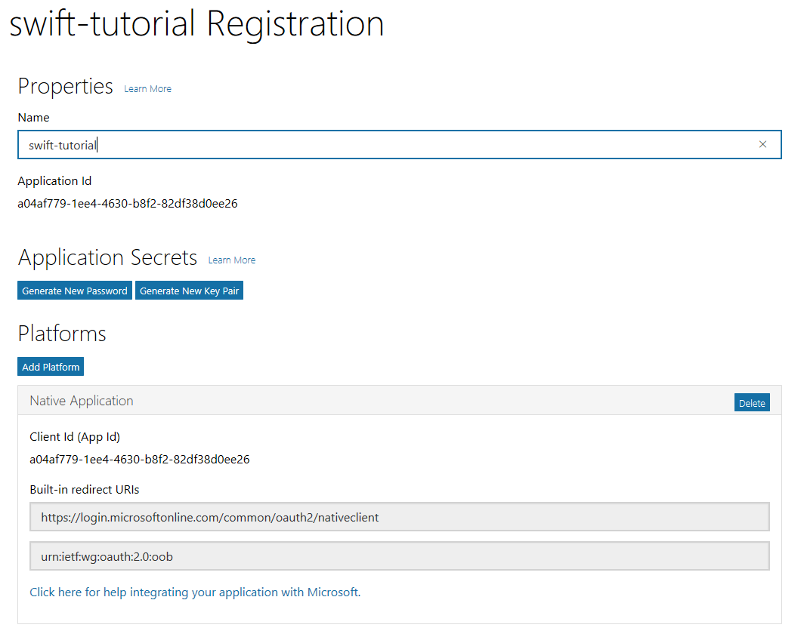

# Getting Started with the Outlook Mail API and Swift #
 
This sample app is the result of following the tutorial at [https://docs.microsoft.com/en-us/outlook/rest/ios-tutorial](https://docs.microsoft.com/en-us/outlook/rest/ios-tutorial). If you follow that tutorial, you should come up with something fairly close to the code in this repository.
 
## Running the sample
 
If you didn't follow the tutorial and just want to download this repo and try it out, you need to do a few things first.
 
### Setup your dev environment
 
This guide assumes:
 
- That you already have Xcode version 8.3 installed.
- That you have an Office 365 tenant, with access to an account in that tenant **OR** an Outlook.com developer preview account.
 
### Register the app
 
Head over to https://apps.dev.microsoft.com to quickly get a client ID and secret. Sign in with either your Microsoft account (Outlook.com), or your work or school account (Office 365).
 
Once you're signed in, click the **Add an app** button. Enter `swift-tutorial` for the name and click **Create application**.

> **Note:** If you don't see **Add an app**, you may need to click the **Skip quickstart** link.
 
Locate the **Platforms** section, and click **Add Platform**. Choose **Native Application**. Replace the value for **Custom Redirect URIs** with `swift-tutorial://oauth2/callback`, then click **Save** to complete the registration. Copy the **Application Id**.
 
Here's what the details of your app registration should look like when you are done.
 

 
Once this is complete you should have an application ID. Replace the `YOUR APP ID HERE` placeholder in [OutlookService.swift](swift-tutorial/OutlookService.swift) with this value and save your changes.
 
## Copyright ##
 
Copyright (c) Microsoft. All rights reserved.
 
----------
Connect with me on Twitter [@JasonJohMSFT](https://twitter.com/JasonJohMSFT)
 
Follow the [Outlook/Exchange Dev Blog](https://blogs.msdn.microsoft.com/exchangedev/)